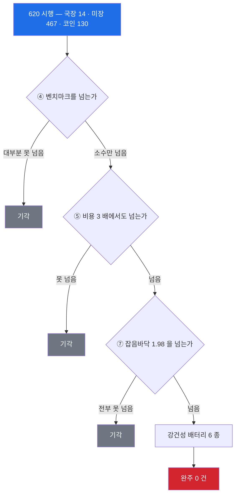
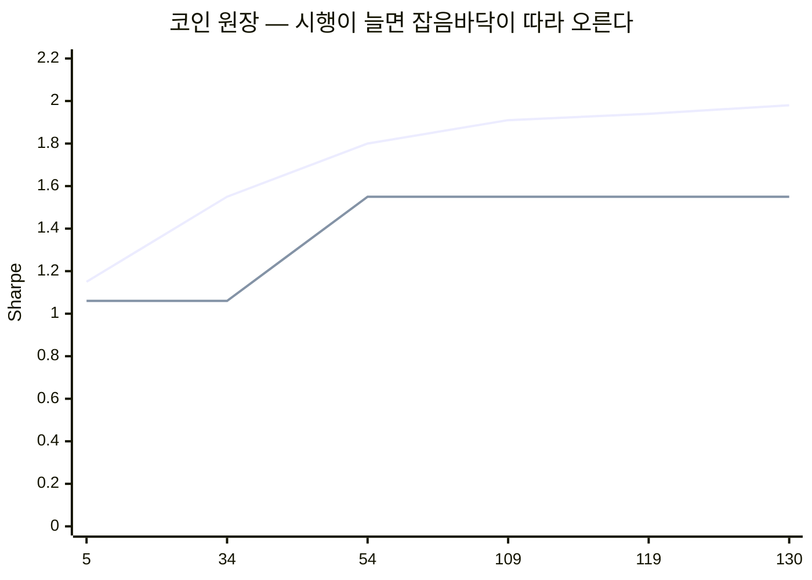
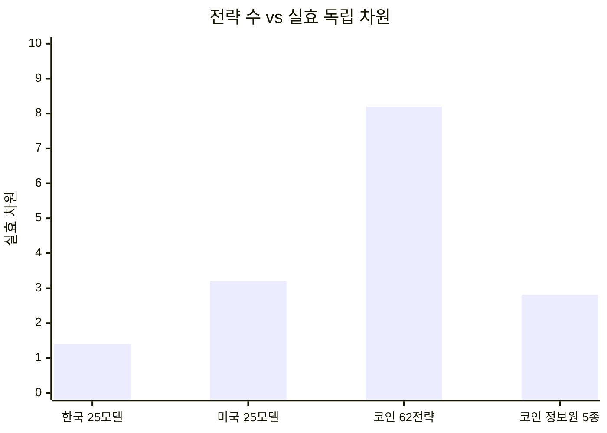
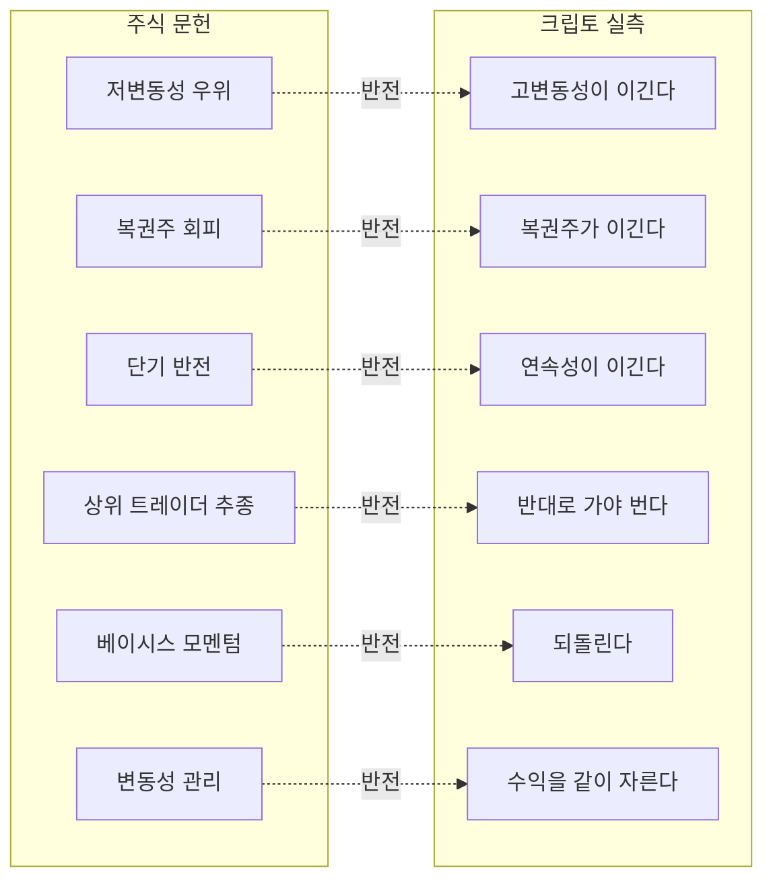

<div align="center">

# STONKS ATLAS

**한국인이 실제로 돈을 넣을 수 있는 도구를 하나씩 검정한 기록**


*남는 것은 전략이 아니라 **전략을 죽이는 방법**과 그 사망 진단서다.*

**[→ 결과 사이트 nohseongmin.github.io/stonks-atlas](https://nohseongmin.github.io/stonks-atlas/)**

</div>

---

## 620 번을 태워서 어디서 죽었나



**최고 후보 둘이 죽은 지점**

| 후보 | Sharpe | 6/7 통과 | 죽은 곳 |
|---|---:|:-:|---|
| `taker_imb_30` (코인 주문흐름) | **1.55** | ✅ | **자산 절제** — 753 중 10 종목 빼면 0.95. LUNA 포함 |
| `mean-rev 딥바잉` (미장) | 0.74 | — | **현금 이자였다** — 무위험 0% 로 두면 0.19 |

---

## 카탈로그를 늘릴수록 통과선이 올라간다

**이게 이 프로젝트에서 가장 중요한 발견일 수 있다.**



<sub>**오르는 선** = 참 실력 0 일 때 우연히 나올 최고 Sharpe(통과선) ·
**평평한 선** = 그 시점 실제 관측 최고. 5 시행에선 관측이 통과선 아래로 살짝 못 미쳤고,
34 시행부터는 **격차가 계속 벌어진다.**</sub>

> 130 시행 시점에서 통과하려면 **Sharpe 1.98** 이 필요하다.
> 외부 실증 최고가 **1.04** 였다. **전략을 더 찾는 행위가 남은 후보를 죽인다.**

---

## 차원이 애초에 2~3 개뿐이다



| 측정 | 값 | 출처 |
|---|---|---|
| 한국 25 모델 | **1.4** | 자체 측정 (쌍상관 +0.832) |
| 미국 25 모델 | **3.2** | 자체 측정 (쌍상관 +0.427) |
| 코인 62 전략 | **8.2** | 자체 측정 |
| 코인 정보원 5 종 | **2.81** | 자체 측정 |
| 유동 크립토 유니버스 자유도 | **1.85** | *Correlation Without Factors* |
| 268 시장 CTA 실효 폭 | **3.81** | `OctopusTakopi` |

> **2~3 차원 공간에서 620 개의 서로 다른 엣지를 찾을 수 없다.**
> 같은 한두 개를 계속 다시 검정한 것이다. **자체 측정과 외부 문헌이 독립적으로 일치한다.**

---

## 시장별 요약

| 시장 | 접근 | 시행 | 통과 | 최고 발견 | 판정 |
|---|---|---:|---:|---|---|
| 🇰🇷 **국장** | 업비트·토스 · **레버리지 0** | 14 | **0** | `KR_XS_하방편차` 0.78 | 2015 년에 소멸 |
| 🇺🇸 **미장** | 토스·키움 | 467 | **0** | mean-rev 딥바잉 | **99% 현금이었다** |
| 🪙 **코인** | 바이낸스 무기한 **150 배** | 130 | **0** | `taker_imb_30` **1.55** | 10 종목이 만들었다 |
| ⚙️ **라이브** | 토스 API 연결 완료 | — | — | 8 주 실검증 사전등록 | **1 일차에 멈춤** |

<div align="center">

### 연구는 620 시행. **배포는 1 일.**

*엣지를 못 찾은 것과 별개로, **찾았어도 운영되지 않았다.***
*자동매매의 병목이 신호가 아니라 **지속 운영**에 있고, 그건 백테스트로 못 잡는다.*

</div>

---

## 크립토는 주식 문헌의 부호가 거꾸로 돈다



**한 번도 결과를 보고 뒤집지 않았다.** 전부 사전등록된 부호 그대로 기록했다 —
뒤집었어도 최고가 +1.27 로 잡음바닥을 못 넘는다.

---

## 수학적 상한 — 레버리지로 못 넘는다

```
CAGR − rf = S·σ − σ²/2      σ = S 에서 최대,  그 값이  rf + S²/2
```

| 관측 최고 Sharpe | 절반켈리 월 수익 | 자본 3,000 만원 기준 |
|---:|---:|---:|
| 1.06 (코인 조합) | **3.21%** | 96 만원 |
| 0.90 (BTC 매수보유) | 2.49% | 75 만원 |
| 0.50 (보수적 가정) | 1.05% | 32 만원 |

> **월 5% 에 필요한 Sharpe 는 1.42.** 620 시행 최고가 1.55 였고 배터리에서 죽었다.
> 반토막 확률 12.5% 를 받아들여야 나오는 숫자다.

---

## 자세히 보기

- [**🇰🇷 국장 상세**](markets/kr.md)
- [**🇺🇸 미장 상세**](markets/us.md)
- [**🪙 코인 상세**](markets/crypto.md)
- [**⚙️ 라이브 운영 실태**](markets/live.md)
- [**전체 표 원본**](README.full.md) — 항목별 검증여부·결과 전부
- [**증거 원본**](evidence/) — 사전등록·결과·원장 130 시행

---

## 방법론 — 이 결과를 믿을 수 있는 이유

<details>
<summary><b>방어 6 겹</b> (펼치기)</summary>

| 방어 | 내용 |
|---|---|
| **사전등록** | 결과 보기 전에 규칙·예상·반증조건을 커밋. **9 건** |
| **관문 7 종** | 시점정합 · 표본길이 · 청산 · 벤치대비 · 비용 3 배 · 낙폭 · 잡음바닥. **fail-closed** |
| **원장** | 기각도 전부 기록. 지문으로 중복 제거. 안 하면 벌점이 거짓말이 된다 |
| **강건성 배터리** | 고원 · 하위표본 · 비용 · 분위 · 자산절제 · 직교성. **죽일 수만 있고 승격 못 시킴** |
| **관문 검정력 시험** | 진짜 좋은 전략을 통과시키는지 확인. 전부 기각하는 관문은 정보가 없다 |
| **룩어헤드 봉인** | `PastView` 가 미래 인덱스에 `IndexError`. 잊어서 새는 게 아니라 **새려고 하면 터진다** |

</details>

<details>
<summary><b>자책 버그 6 개 — 관문이 잡은 건 0 개다</b> (펼치기)</summary>

테스트와 물리적 제약이 잡았다.

| 버그 | 어떻게 걸렸나 |
|---|---|
| ctx 가 원본 전체 배열이라 미래가 샘 | SPY 와 상관 **1.0000** 이 이상해서 |
| 횡단면 가동률 54% | 부호 연속 **2,358 일**이 물리적으로 불가능해서 |
| 봉 사이 갭을 통째로 버림 | 심어둔 신호를 테스트가 복원 못 해서 |
| `PastView` 가 빈 배열에 길이 60 주장 | 유동성 필터가 거래대금 0 종목을 통과시킬 뻔 |
| OI 파서가 예외 시 배열 길이 어긋남 | **354 심볼이 죽어서** |
| 한자 심볼 URL 미인코딩 | 유니버스 스캔이 통째로 멈춰서 |

</details>

<details>
<summary><b>외부 실증도 같은 자리에 있다</b> (펼치기)</summary>

| 출처 | 정직한 처리 후 Sharpe |
|---|---:|
| `bryanvine/alpha-research` | **0.39** (정제 전진검증) |
| `OctopusTakopi/funding-rate-alpha` | 0.77 (2020~21 제외) |
| `OctopusTakopi/crypto-trend-following` | 0.68 ~ 1.04 |

> **공개 명세를 가진 크립토 전략이 공개 후 3 년 이상 작동한
> 독립 검증 사례는 하나도 없다.**

</details>

---

## 구조

```
README.md          지금 이 문서 — 요약
README.full.md     전체 표 원본
markets/           시장별 상세: kr · us · crypto · live
evidence/          사전등록·결과·원장 원본
crypto/            코인 하네스 본체 — dumpItAll 을 이력째 편입
verify/            딥바잉 검정기 (미장)
```

```bash
python -m crypto.dump.costs        # 비용 산술 — 첫 관문
python -m crypto.dump.feed         # 시점정합 유니버스 (상폐 266 포함)
python -m crypto.dump.runzoo       # 팩터 52 개 일괄
python -m crypto.dump.battery      # 강건성 배터리 6 종
cd crypto && python -m pytest -q   # 88 tests
```

<details>
<summary><b>격리된 원본 5 개</b> (펼치기)</summary>

| 저장소 | 시장 | 내용 |
|---|---|---|
| [`legacy-dumpItAll`](https://github.com/nohseongmin/legacy-dumpItAll) | 코인 | `crypto/` 로 편입됨. 원본 이력 보관 |
| [`legacy-STONKS-03`](https://github.com/nohseongmin/legacy-STONKS-03) | 3 시장 | 480 시행 카탈로그 · 잡음바닥·실효차원 도구 · DART 수집기 |
| [`legacy-ai-stonks-v2`](https://github.com/nohseongmin/legacy-ai-stonks-v2) | 미장 | ORB · Alpha101 · 일봉스윙 · RiskGovernor |
| [`legacy-AI-STONKS`](https://github.com/nohseongmin/legacy-AI-STONKS) | 국장·미장 | 라이브 토스 자동매매 |
| [`legacy-STONKS`](https://github.com/nohseongmin/legacy-STONKS) | 미장 | 최초 예측모델 |

</details>

---

<div align="center">

## 후향 탐색은 끝났다

시장 **안**(OHLCV · 펀딩 · 주문흐름 · 포지션 · 베이시스)도
시장 **밖**(공시 재무제표)도 없었다.

**무료로 얻을 수 있는 정보원을 전부 열었고, 차원 측정이 더 찾을 곳이 없다고 말한다.**

### 다음은 신호가 아니라 운영이다

*620 시행보다 **1 일 운영**이 더 큰 병목이었다.*

</div>
